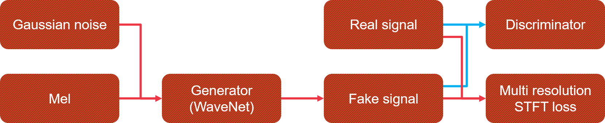
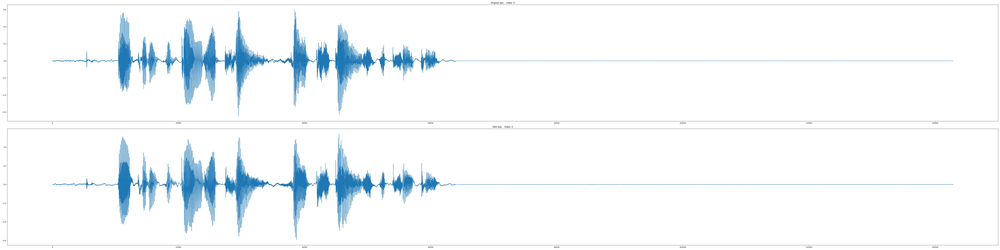
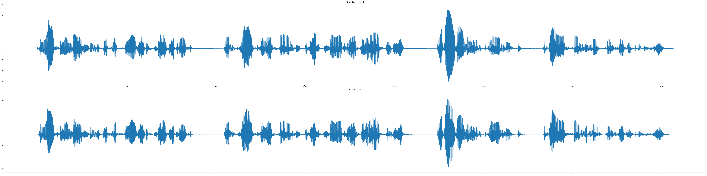
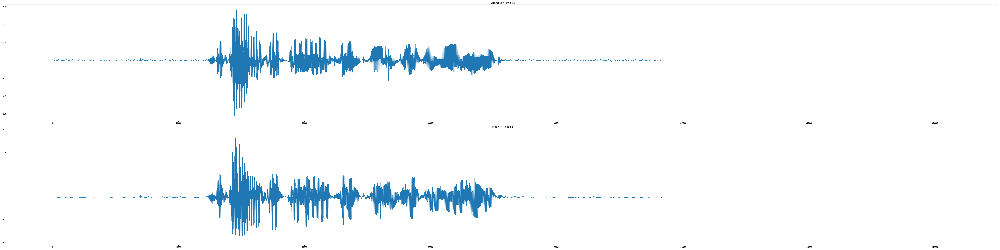
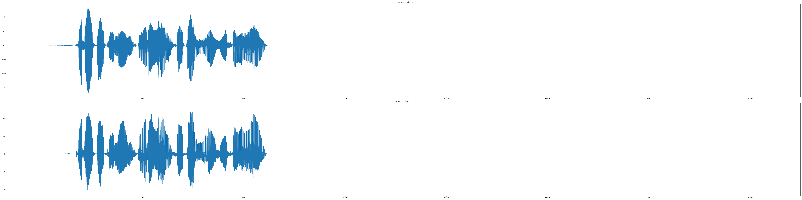

# Parallel Voice Conversion GAN

This code is a replication code of [kan-bayashi's code](https://github.com/kan-bayashi/ParallelWaveGAN). I wrote this code for my independent study about PyTorch. If you want to use Parallel WaveGAN model, I recommend that you refer to the original kan-bayashi's code.

The following is the paper I referred:
```
Oord, A. V. D., Dieleman, S., Zen, H., Simonyan, K., Vinyals, O., Graves, A., ... & Kavukcuoglu, K. (2016). Wavenet: A generative model for raw audio. arXiv preprint arXiv:1609.03499.
Yamamoto, R., Song, E., & Kim, J. M. (2020, May). Parallel WaveGAN: A fast waveform generation model based on generative adversarial networks with multi-resolution spectrogram. In ICASSP 2020-2020 IEEE International Conference on Acoustics, Speech and Signal Processing (ICASSP) (pp. 6199-6203). IEEE.
```

# Requirements
* torch == 1.4.0
* tensorboardX == 2.0
* librosa >= 0.7.2

* Optional    
    * tensorboard >= 2.2.2 (for loss flow)
    * apex >= 0.1 (for mixed precision)

# Structrue


# Used dataset
Currently uploaded code is compatible with the following datasets. The O mark to the left of the dataset name is the dataset actually used in the uploaded result.

```
[O] LJSpeech: https://keithito.com/LJ-Speech-Dataset/
[X] VCTK: https://datashare.is.ed.ac.uk/handle/10283/2651
[X] LibriSpeech: https://www.openslr.org/12
[X] TIMIT: http://academictorrents.com/details/34e2b78745138186976cbc27939b1b34d18bd5b3
[X] Blizzard Challenge 2013: http://www.cstr.ed.ac.uk/projects/blizzard/
[O] FastVox: http://www.festvox.org/cmu_arctic/index.html
```

# Hyper parameters
Before proceeding, please set the pattern, inference, and checkpoint paths in 'Hyper_Parameter.yaml' according to your environment.

* Sound
    * Setting basic sound parameters.

* WaveNet
    * Setting the parameters of generator based on WaveNet.
    * In upsample, the product of all of upsample scales must be same to frame shift size of sound.

* Discriminator
    * Setting the parameters of discriminator

* STFT_Loss_Resolution
    * Setting the parameters of multi resolution STFT loss.

* Train
    * Setting the parameters of training.    
    * Wav length must be a multiple of frame shift size of sound.
    
* Inference_Path
    * Setting the inference path

* Checkpoint_Path
    * Setting the checkpoint path

* Log_Path
    * Setting the tensorboard log path

* Use_Mixed_Precision
    * If true, mixed preicision is used.
    * This option requires `nividia apex` module.

* Device
    * Setting which GPU device is used in multi-GPU enviornment.
    * Or, if using only CPU, please set '-1'.

# Generate pattern

## Command
```
python Pattern_Generate.py [parameters]
```

## Parameters

At least, one or more of datasets must be used.

* -lj <path>
    * Set the path of LJSpeech. LJSpeech's patterns are generated.
* -vctk <path>
    * Set the path of VCTK. VCTK's patterns are generated.
* -ls <path>
    * Set the path of LibriSpeech. LibriSpeech's patterns are generated.
* -timit <path>
    * Set the path of TIMIT. TIMIT's patterns are generated.
* -bc2013 <path>
    * Set the path of Blizzard Challenge 2013. Blizzard Challenge 2013's patterns are generated.
* -fv <path>
    * Set the path of FastVox. FastVox's patterns are generated.
* -all
    * All save option.
    * Generator ignore the 'Train/Min_Wav_Length' and 'Train/Max_Wav_Length' of hyper parameters.
    * If this option is not set, only patterns matching 'Train/Min_Wav_Length' and 'Train/Max_Wav_Length' are generated. 
* -mc
    * Ignore patterns that exceed the set number of each dataset.
* -mw
    * The number of threads used to create the pattern

# Run

## Modyfy inference file path while training for verification.

* Inference_Wav_for_Training.txt
    * Wav file paths which are used to evaluate while training.

## Command
```
python Train.py -s <int>
```

* `-s <int>`
    * The resume step parameter.
    * Default is 0.

# Inference
```
python Inference.py -c <path> -m <path> -r <path>
```
* `-c <path>`
    * The checkpoint path.
    * This parameter is required.
* `-m <path>`
    * The folder path which mel-spectrograms are sved.
    * Each mel-spectrogram's shape must be `[Time, Dim]`.
    * This parameter is required.
* `-r <path>`
    * The result path.
    * Default is `./result`.

# Result
* The following results are based on the checkpoint of 400000 steps of 6 batchs (114.22 epochs).
* The results are based on the mels of ground truth. I did not combine this model to any TTS like Tacotron yet.

## FastVox AWB A0001 (Trained)
[Wav_IDX_0](./Example_Results/Wav/Step-400000.IDX_0.WAV)


## LJSpeech (Trained)
[Wav_IDX_1](./Example_Results/Wav/Step-400000.IDX_1.WAV)


## VCTK 226 Surrey (Unseen)
[Wav_IDX_2](./Example_Results/Wav/Step-400000.IDX_2.WAV)


## KSS (Unseen, not English)
[Wav_IDX_3](./Example_Results/Wav/Step-400000.IDX_3.WAV)


# Trained checkpoint
[Checkpoint here](./Example_Results/Checkpoint.zip)

* This is the checkpoint of 400000 steps of 6 batchs (114.22 epochs).
* There is the hyper-parameter about this checkpoint in the zip file.

# Future works
* I am searching the method to port this model to tensorflow's model to combine to my tacotron code.
